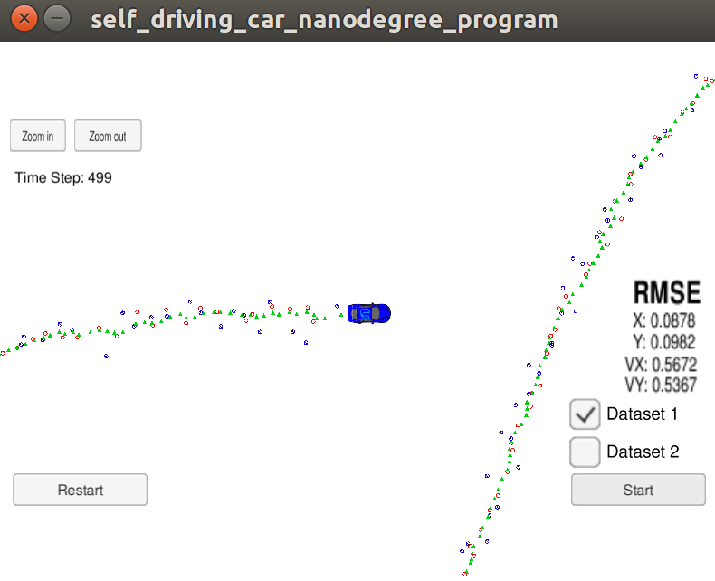
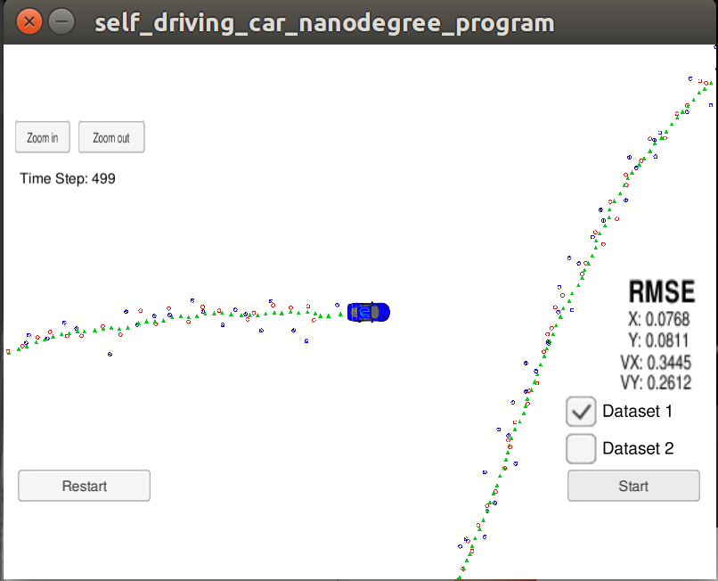
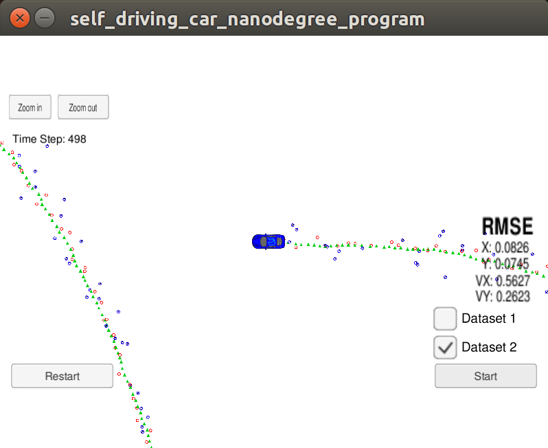
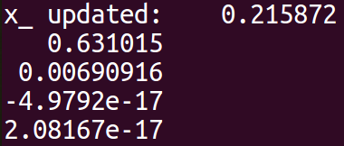
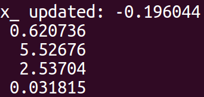
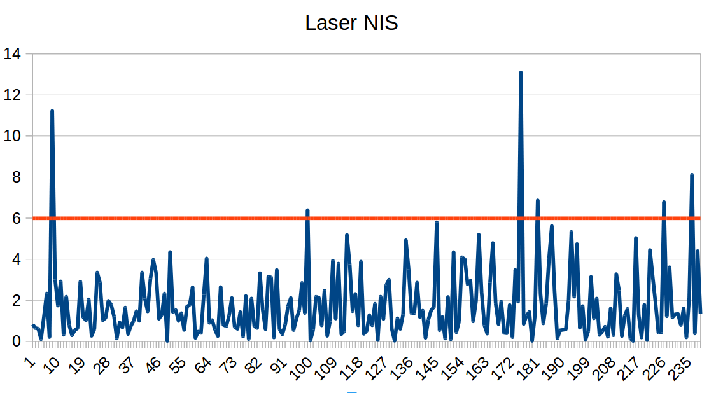
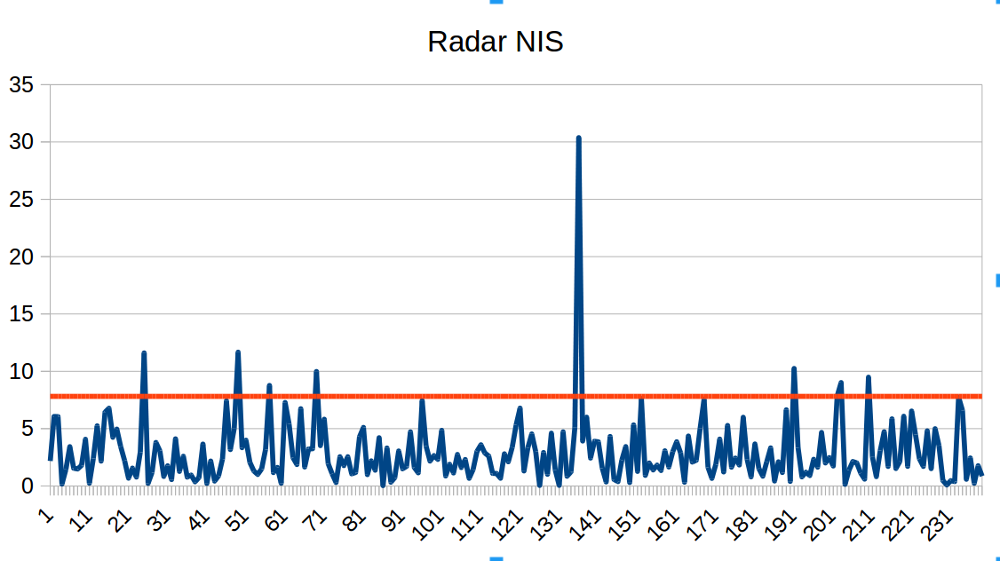
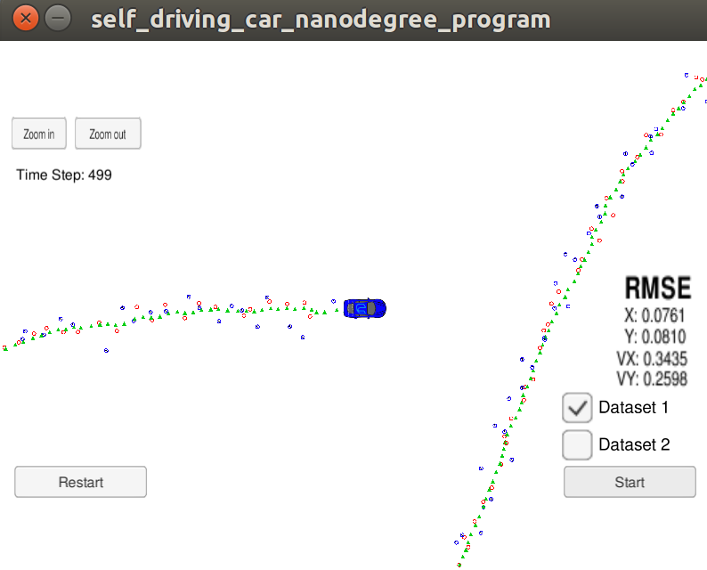

# Unscented Kalman Filter Project Starter Code
Self-Driving Car Engineer Nanodegree Program

In this project utilize an Unscented Kalman Filter to estimate the state of a moving object of interest with noisy lidar and radar measurements. Passing the project requires obtaining RMSE values that are lower that the tolerance outlined in the project rubric. 

This project involves the Term 2 Simulator which can be downloaded [here](https://github.com/udacity/self-driving-car-sim/releases).

This repository includes two files that can be used to set up and intall [uWebSocketIO](https://github.com/uWebSockets/uWebSockets) for either Linux or Mac systems. For windows you can use either Docker, VMware, or even [Windows 10 Bash on Ubuntu](https://www.howtogeek.com/249966/how-to-install-and-use-the-linux-bash-shell-on-windows-10/) to install uWebSocketIO. Please see the uWebSocketIO Starter Guide page in the classroom within the EKF Project lesson for the required version and installation scripts.

Once the install for uWebSocketIO is complete, the main program can be built and ran by doing the following from the project top directory.

1. mkdir build
2. cd build
3. cmake ..
4. make
5. ./UnscentedKF

Tips for setting up your environment can be found in the classroom lesson for the EKF project.

Note that the programs that need to be written to accomplish the project are src/ukf.cpp, src/ukf.h, tools.cpp, and tools.h

The program main.cpp has already been filled out, but feel free to modify it.

Here is the main protocol that main.cpp uses for uWebSocketIO in communicating with the simulator.


INPUT: values provided by the simulator to the c++ program

["sensor_measurement"] => the measurment that the simulator observed (either lidar or radar)


OUTPUT: values provided by the c++ program to the simulator

["estimate_x"] <= kalman filter estimated position x
["estimate_y"] <= kalman filter estimated position y
["rmse_x"]
["rmse_y"]
["rmse_vx"]
["rmse_vy"]

---

## Other Important Dependencies
* cmake >= 3.5
  * All OSes: [click here for installation instructions](https://cmake.org/install/)
* make >= 4.1 (Linux, Mac), 3.81 (Windows)
  * Linux: make is installed by default on most Linux distros
  * Mac: [install Xcode command line tools to get make](https://developer.apple.com/xcode/features/)
  * Windows: [Click here for installation instructions](http://gnuwin32.sourceforge.net/packages/make.htm)
* gcc/g++ >= 5.4
  * Linux: gcc / g++ is installed by default on most Linux distros
  * Mac: same deal as make - [install Xcode command line tools](https://developer.apple.com/xcode/features/)
  * Windows: recommend using [MinGW](http://www.mingw.org/)

## Stage 1 make UKF runing!
In order to bring filter to live, a fair bunch of functions needed to be implemented. For better readabaility, some additional methods were added to the class:
```
  /**
   * Generating Augmented Sigma Points Matrix
   * @param Xsig_out Matrix were the output data will be written
   */
  void AugmentedSigmaPoints(MatrixXd* Xsig_out);
  /**
   * Predict Sigma Points - the result is written into class variable - Xsig_pred_
   * @param Xsig_aug - matrix generated by AugmentedSigmaPoints(), delta_t - elapsed tiime
   */
  void PredictSigmaPoints(MatrixXd Xsig_aug, double delta_t);
  /**
   * Predic tMean And Covariance - the result is written into class variables - x_ and P_
   * 
   */
  void PredictMeanAndCovariance();
```
The first three of above functions are a complete Prediction step. They are called one by one in ``void UKF::Prediction(double delta_t)`` function. The update step is implemented separately for laser and lider with using the prepared in starter code functions: 
```
  void UpdateLidar(MeasurementPackage meas_package);
  void UpdateRadar(MeasurementPackage meas_package);
  ```
  
## Stage 2 UKF tuning!
After first stage and run the simulator, the results where slightly worse then with Kalman filter, and below the project expectations:

With following P covariance and process noise:
```
  P_ << 0.1, 0,   0, 0, 0,
        0,   0.1, 0, 0, 0,
        0,   0,   1, 0, 0,
        0,   0,   0, 1, 0,
        0,   0,   0, 0, 1;

  std_a_ = 2;

  // Process noise standard deviation yaw acceleration in rad/s^2
  std_yawdd_ = 0.3;
```
The results met project specifications:

## Stage 3 Initialisation
But for the second data set, result were still bad:

One of the reason was, that the initial ``teta`` was set to ``0``. In the first data set the object is moving in right direction with angle aroun ``0``. In the second the object is moving oposite with angle ``180`` degree. One of the possible improvement was to make better initialisation of ``x`` state vector. To get information about the initial angle, the second initialisation step was introduced. In that soution, we cathered two measrements data before triggered Kalman filter. Based on the two consecutive measuremets the initial angle can be estimated. The effect could be seen by checking the first prediction of Kalman filter. In the one step initialisation the vector has ``teta = 0``:

In the two-step initialisation the angle is more close to the actual:

As the final result has better 3 of four RMSE values

## Stage 4 NIS
In the last stage the consistency were checked. In function:
```
  /**
   * Calculating Normalized Innovation Squared value for consistency check
   * @param S - covariance matrix , z_pred - predicted measurements, 
   * z_meas - actual measurements, type - coded type of sensor: true - radar, false - laser
   */
  void NIS(MatrixXd S, VectorXd z_pred, VectorXd z_meas, bool type);
```
the NIS value is calculated for every measuremnt sample and written to a file.


In the charts the red line is the expect NIS value for 5% values. For Radar it turned out to be 4.4%, and for laser 2.8%.
The results could be interpeted as acceptable, and consistency of the filter is confirmed, but some little aditional play with the noise parameters were conducted, finally lead to a little improvement:


With final RMSE values:
* X: 0.0761, 
* Y: 0.0810, 
* VX 0.3435, 
* VY 0.2598


