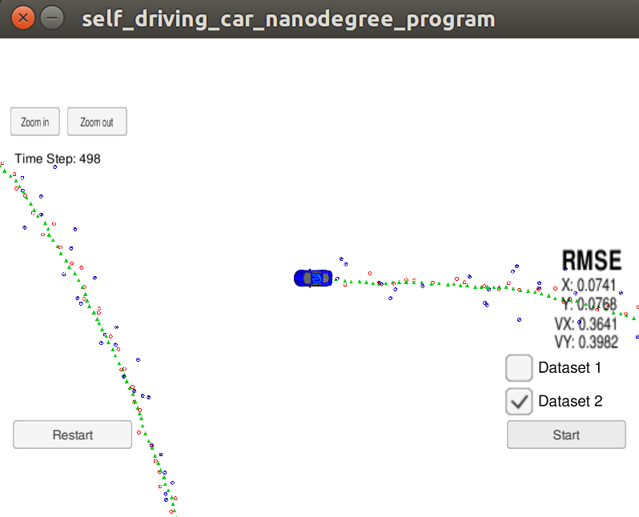
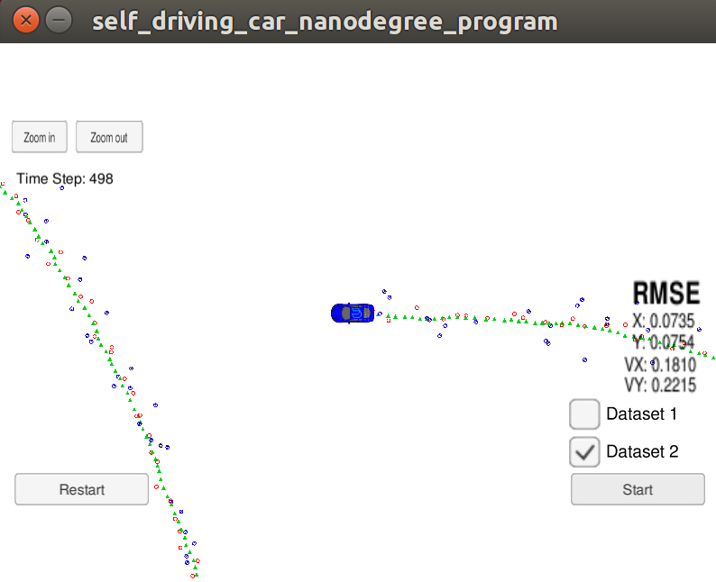

# Unscented Kalman Filter Project
Self-Driving Car Engineer Nanodegree Program

In this project utilize an Unscented Kalman Filter to estimate the state of a moving object of interest with noisy lidar and radar measurements. Passing the project requires obtaining RMSE values that are lower that the tolerance outlined in the project rubric. 

Project starter code and installation instructions you can find here https://github.com/udacity/CarND-Unscented-Kalman-Filter-Project


## Step 1 - make UKF running
In order to bring the filter to life, all Kalman filter steps needed to be implemented within a given program structure. For better readability, some additional methods were added to the class:
```
  /**
   * Generating Augmented Sigma Points Matrix
   * @param Xsig_out Matrix were the output data will be written
   */
  void AugmentedSigmaPoints(MatrixXd* Xsig_out);
  /**
   * Predict Sigma Points - the result is written into class variable - Xsig_pred_
   * @param Xsig_aug - matrix generated by AugmentedSigmaPoints(), delta_t - elapsed tiime
   */
  void PredictSigmaPoints(MatrixXd Xsig_aug, double delta_t);
  /**
   * Predic tMean And Covariance - the result is written into class variables - x_ and P_
   * 
   */
  void PredictMeanAndCovariance();
```
Above functions together are a complete Prediction step. They are called in ``void UKF::Prediction(double delta_t)``. 
The update step is implemented separately for laser and lider with using prepared in starter code methods: 
```
  void UpdateLidar(MeasurementPackage meas_package);
  void UpdateRadar(MeasurementPackage meas_package);
```
  
## Step 2 - UKF tuning
After completing first step and running the simulator, the results where slightly worse then with Extended Kalman filter (see https://github.com/robertklonek/t2-p1-ExtendedKalmanFilter), and far below the project expectations:

<p align="center">

</p>

The filter parameters needed to be changed. According to the project description the following should be taken into the account: covariance matrix ``P``, process noises ``std_a_`` and ``std_yawdd_``.  Covariance matrix should indicate that 3 last elements are uknown, so for them, initial values should be much higher than for the first two. It was also obvious that inital values of process noises were overestimated. After some trials, the following setting brought the satisfying results:
```
  P_ << 0.1, 0,   0, 0, 0,
        0,   0.1, 0, 0, 0,
        0,   0,   1, 0, 0,
        0,   0,   0, 1, 0,
        0,   0,   0, 0, 1;

  std_a_ = 2;
  std_yawdd_ = 0.3;
```

And what is more, these result met project specifications:

<p align="center">

</p>

## Step 3 - Initialisation

But for the second data set, ``VX`` appeared much higher:

<p align="center">

</p>

One of the reason was, that the initial yaw angle was unknown and set to ``0``. In the first data set the object is starting moving in the right direction with yaw angle around ``0``. In the second the object is moving oposite with init yaw angle around ``180`` degree. One of the possible improvement was to make better initialisation of yaw angle in ``x`` state vector. To get information about it, the **two steps initialisation** was introduced. In that solution, we gathered two measurements data before triggering Kalman filter. Based on those two the initial yaw angle and velocity can be estimated. The effect could be seen by checking the first prediction of Kalman filter. In the ordinary initialisation the vector has ``x`` has yaw angle close to zero (second row from bottom):

<p align="center">

</p>

In the two-step initialisation method the angle is much closer to the actual:

<p align="center">

</p>

In the final result the ``VX`` has been significantly reduced:

<p align="center">

</p>

Unfortunatelly the ``VY`` velocity increased. This is becouse to the fact that just two measurements can be not enough to properly init the yaw angle. To check how far exactly the init values influence the final result the following test was prepared: the init values for the velocity and yaw angle was forced in the initialization step accordingly to ``5`` and ``3.1``. Coresponding coefficients in covariance matrix ``P`` were reduced. The result is absolutely great:

<p align="center">

</p>

It clearly shows how big the initial values are important for Kalman filter. The proposed two-step method could be furhter improved and achive result much better that with standard initialization method.

## Step - 4 NIS
In the last step the filter consistency were checked. In following function:
```
  /**
   * Calculating Normalized Innovation Squared value for consistency check
   * @param S - covariance matrix , z_pred - predicted measurements, 
   * z_meas - actual measurements, type - coded type of sensor: true - radar, false - laser
   */
  void NIS(MatrixXd S, VectorXd z_pred, VectorXd z_meas, bool type);
```
the NIS value is calculated for every measurement sample and written into the file.

<p align="center">

</p>
<p align="center">

</p>

In the charts above the red line is the expected NIS value for 5% values. For Radar it turned out to be 4.4%, and for laser 2.8%.
The results could be accepted, and consistency of the filter would be confirmed, but some little aditional tuning with the noise parameters were conducted, finally led to following improvement:

<p align="center">

</p>

With final RMSE values:
* X: 0.0761, 
* Y: 0.0810, 
* VX 0.3435, 
* VY 0.2598


